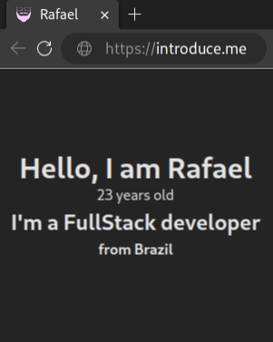

```tsx
import React from 'react';

let Developer = {
  Name: "Rafael",
  Age: 23,
  Nacionality: "Brazil",
  Work: "FullStack"
}

function App(){
  return(
    <div>
      <h1>Hello, I am {Developer.Name}</h1>
      <p>{Developer.Age} years old</p>
      <h2> I'm a {Developer.Work} developer</h2>
      <strong>from {Developer.Nacionality}</strong>
    </div>
  )
}
export default App;
```

<br />


## 👩‍💻 Skills


## 🌐 DataBases


## 💻 Tools


## ✉️ Contact:

[](www.linkedin.com/in/rafael-gonçalves-52a146190)
[](mailto:contato@rafaelgoncalves.tech.com)
